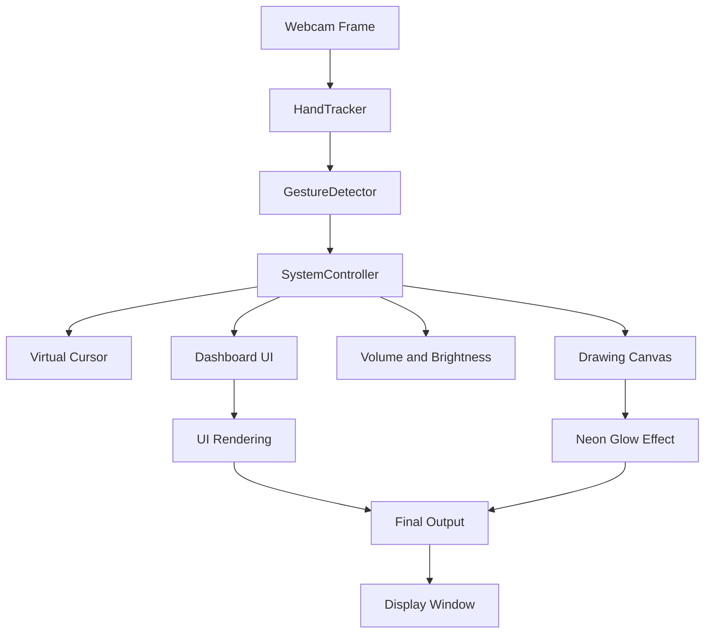

# Gesture-Controlled Drawing Dashboard

**Real-time, camera-based Human-Computer Interaction system with glassmorphism UI and neon visual effects**

<div align="center">

[](https://www.python.org/)
[](https://opencv.org/)
[](LICENSE)

</div>

---

## Project Overview

This project implements a real-time hand-gesture-based Human-Computer Interaction (HCI) system. Using just a standard webcam, users can control the system cursor, adjust volume and screen brightness, and draw on a virtual canvas -- all without touching any input device.

The interface is rendered entirely through OpenCV drawing primitives and features a glassmorphism design language with neon glow effects, frosted-glass panels, pulsating indicators, and smooth fade animations.

**Supported Platforms:** Ubuntu (Linux) and macOS only. The `platform_utils.py` module provides OS-specific backends for brightness control (GNOME D-Bus, brightnessctl, xrandr on Linux; osascript / brightness CLI on macOS) and volume control (amixer on Linux; osascript on macOS). Windows is not supported.

Key design principles:

- **Zero-touch interaction** using MediaPipe 21-point hand landmark detection
- **Predictive smoothing** with Exponential Moving Average (EMA) filters and velocity-based prediction for lag-free cursor movement
- **Four independent modes** -- MOUSE, MEDIA, DRAWING, BRIGHTNESS -- switched by holding a closed palm for 3 seconds
- **Modular architecture** with clean separation between hand tracking, gesture classification, system control, and UI rendering

---

## Problem Statement

Traditional mouse and keyboard interfaces are not suitable for touchless environments such as cleanrooms, AR/VR setups, accessibility scenarios, or live presentations. Existing gesture-control demos typically suffer from:

- Laggy, jittery cursor movement
- Minimal or inconsistent visual feedback
- Limited to a single interaction mode (usually just mouse control)
- No visual polish -- debug-quality UIs

This project addresses all of these by delivering a high-performance, visually polished gesture-control framework with multiple interaction modes and a premium UI.

---

## Solution

The system is built as a processing pipeline:

1. **Hand Detection** -- `hand_tracker.py` wraps MediaPipe Hands to detect and track 21 hand landmarks in real time
2. **Gesture Classification** -- `gesture_detector.py` classifies the hand pose into one of seven gestures using fingertip position analysis and a temporal stability filter
3. **System Control** -- `controller.py` routes gestures to actions (cursor movement, clicks, drawing, volume/brightness adjustment) based on the currently active mode
4. **UI Rendering** -- `drawing_dashboard.py` and `utils.py` render the glassmorphism HUD, floating toolbar, neon glow effects, and vignette overlays
5. **Platform Abstraction** -- `platform_utils.py` handles OS-specific volume and brightness commands with non-blocking execution and rate limiting

---

## Features

| Feature | Description |
|---------|-------------|
| **Gesture-Driven Mouse** | Index-finger movement maps to the system cursor with predictive acceleration, dead-zone filtering, non-linear edge boost, and a precision mode (thumb-up gesture) |
| **Left and Right Click** | Pinch gesture triggers left click; two-finger gesture triggers right click. Both have cooldown-based debouncing |
| **Volume Control** | In MEDIA mode, thumb-to-index-finger distance maps to system volume (0-100%). A glassmorphism vertical bar with neon green fill shows the current level |
| **Brightness Control** | In BRIGHTNESS mode, thumb-to-index distance maps to screen brightness with adaptive sensitivity based on ambient light analysis from the webcam feed |
| **Drawing Canvas** | In DRAWING mode, the index finger draws on a virtual canvas overlay. Brush strokes use EMA-smoothed trajectories with predictive interpolation for fluid lines |
| **Neon Glow Effect** | Canvas strokes are rendered with a configurable Gaussian blur glow that is composited onto the camera feed |
| **Floating Dashboard** | A frosted-glass toolbar with 8 color swatches, a thickness slider (2-25px), a glow intensity slider (0-100%), and three action buttons (Undo, Clear, Save) |
| **Eraser** | Open palm gesture in DRAWING mode erases canvas content with a smoothed circular eraser |
| **Undo Stack** | Up to 10 previous canvas states can be restored via the Undo button |
| **Screenshot Export** | Save button captures the current composited frame (camera + canvas overlay) as a timestamped PNG file |
| **Camera Modes** | Toggle between CAM ON (full feed), CAM DIM (30% brightness), and CAM DARK (black background) via the top-left button |
| **Idle Detection** | When no hand is detected for more than 2 seconds, a pulsing "Waiting for Hand..." indicator appears |
| **Toast Notifications** | Glassmorphism toast messages with fade-in/fade-out animations appear for mode switches, clicks, and dashboard actions |
| **Fullscreen Toggle** | Press `f` to toggle fullscreen; the window stays on top on Linux |
| **Mode Switching** | Hold a closed fist for 3 seconds to cycle through MOUSE, MEDIA, DRAWING, and BRIGHTNESS modes. A neon progress bar shows hold progress |
| **Ambient Light Sensing** | The brightness mode periodically analyzes the webcam frame to detect low-light or bright environments and adjusts sensitivity accordingly |

---

## Gesture Reference

| Gesture | Fingers | Detection Logic |
|---------|---------|-----------------|
| **INDEX_UP** | Only index finger raised | `fingers == [0, 1, 0, 0, 0]` |
| **TWO_FINGERS** | Index + middle raised | `fingers == [0, 1, 1, 0, 0]` |
| **PINCH** | Thumb and index tips within 40px, other fingers closed | `pinch_dist < 40 and fingers[2:] == [0, 0, 0]` |
| **THUMB_UP** | Only thumb raised (with optional index) | `fingers == [1, 0, 0, 0, 0]` or `[1, 1, 0, 0, 0]` |
| **OPEN_PALM** | Four or more fingers raised | `fingers.count(1) >= 4` |
| **CLOSED_PALM** | All four fingers (excluding thumb) closed | `fingers[1:] == [0, 0, 0, 0]` |
| **UNKNOWN** | No recognizable pattern | Default fallback |

All gestures pass through a temporal stability filter (configurable duration, default 0.1s) to prevent flickering between states.

---

## Mode Controls

| Mode | Gesture | Action |
|------|---------|--------|
| **MOUSE** | INDEX_UP | Move system cursor (with EMA smoothing + predictive tracking) |
| **MOUSE** | THUMB_UP | Precision mode -- very slow, fine-grained cursor movement (alpha=0.05) |
| **MOUSE** | PINCH | Left click at current cursor position |
| **MOUSE** | TWO_FINGERS | Right click at current cursor position |
| **MEDIA** | INDEX_UP / OPEN_PALM | Thumb-to-index distance controls system volume |
| **DRAWING** | INDEX_UP | Draw on canvas with current color and thickness |
| **DRAWING** | PINCH | Interact with dashboard (color selection, slider adjustment, button press) |
| **DRAWING** | OPEN_PALM | Eraser mode (30px radius, centered on palm) |
| **BRIGHTNESS** | INDEX_UP / OPEN_PALM | Thumb-to-index distance controls screen brightness |
| **Any Mode** | CLOSED_PALM (hold 3s) | Switch to next mode (MOUSE -> MEDIA -> DRAWING -> BRIGHTNESS -> MOUSE) |

**Keyboard shortcuts:**
- `q` -- quit the application
- `f` -- toggle fullscreen

---

## Tech Stack

| Layer | Technology | Purpose |
|-------|------------|---------|
| Language | Python 3.11+ | Core application logic |
| Computer Vision | OpenCV (opencv-python) | Frame capture, image processing, UI rendering, window management |
| Hand Tracking | MediaPipe Hands | 21-point hand landmark detection and tracking |
| Array Processing | NumPy | Canvas operations, interpolation, Gaussian kernels |
| System Automation | PyAutoGUI | Cross-platform mouse cursor movement and click simulation |
| Volume Control | amixer (Linux), osascript (macOS) | System volume adjustment via subprocess |
| Brightness Control | GNOME D-Bus / brightnessctl / xrandr (Linux), osascript (macOS) | Hardware/software brightness adjustment |
| Speech (optional) | SpeechRecognition | Listed in requirements (not actively used in current version) |

---

## System Architecture



**Detailed data flow:**

1. **Frame Capture** -- `main.py` captures frames from the webcam at 640x480 resolution with auto-detection of camera index (tries 0, 1, 2)
2. **Hand Detection** -- `HandTracker.find_hands()` converts the frame to RGB and passes it to MediaPipe, storing the result landmarks
3. **Landmark Extraction** -- `HandTracker.get_position()` converts normalized landmarks to pixel coordinates as a list of `[id, x, y]`
4. **Gesture Classification** -- `GestureDetector.detect_gesture()` analyzes finger states and pinch distance, applies a stability filter, and returns the stable gesture name
5. **Mode Routing** -- `main.py` routes the gesture to the appropriate handler in `SystemController` based on the current mode
6. **Canvas Compositing** -- The drawing canvas is processed through `apply_neon_glow()` (Gaussian blur blend) and merged with the camera frame using bitwise operations
7. **UI Overlay** -- HUD elements (FPS pill, mode indicator, gesture label, camera mode button, dashboard toolbar) are drawn on top
8. **Vignette** -- `apply_vignette()` applies a Gaussian-kernel-based darkening around frame edges for a cinematic look
9. **Display** -- The final composited frame is shown via `cv2.imshow()`

---

## File Structure

```
gesture-drawing-dashboard/
  main.py                 -- Application entry point and main loop
  hand_tracker.py         -- MediaPipe hand detection wrapper with neon skeleton renderer
  gesture_detector.py     -- Gesture classification with finger-state analysis and stability filter
  controller.py           -- SystemController handling cursor, clicks, drawing, volume, brightness
  drawing_dashboard.py    -- Floating toolbar UI, neon glow effect, vignette shader
  platform_utils.py       -- OS-specific brightness and volume backends (Ubuntu and macOS)
  utils.py                -- EMAFilter, FPSCounter, glassmorphism drawing helpers, toast system
  requirements.txt        -- Python dependencies
  README.md               -- This file
```

### Module Details

**main.py** (459 lines) -- The main event loop. Initializes the camera with auto-detection, creates all module instances, handles the frame processing pipeline, mode switching logic (closed-palm hold with progress bar), gesture-to-action routing for all four modes, dashboard mouse interaction, canvas compositing, and HUD rendering.

**hand_tracker.py** (88 lines) -- Wraps MediaPipe Hands with configurable detection/tracking confidence. Implements `_draw_neon_hand()` which renders a custom cyberpunk-style hand skeleton with color-coded joints (pink for fingertips, cyan for wrist, amber for mid-joints) and glowing connection lines.

**gesture_detector.py** (73 lines) -- Implements `fingers_up()` to determine which of the 5 fingers are raised using landmark Y-coordinates (and X-coordinate for the thumb). The `detect_gesture()` method classifies the hand into 7 gesture types with a time-based stability filter to prevent flickering.

**controller.py** (481 lines) -- The largest module. Contains:
- **Mouse control** with dead-zone filtering (ignores movements < 6px), dynamic EMA alpha (0.15 for slow, 0.85 for fast movement), non-linear edge acceleration (up to 2.5x boost near screen edges), and predictive tracking (0.4x velocity extrapolation)
- **Drawing engine** with EMA-smoothed strokes (alpha=0.35), predictive interpolation, and line-based stroke connection
- **Eraser** with smoothed circular erasing
- **Undo stack** supporting up to 10 states
- **Volume handler** with glassmorphism vertical bar UI, threshold-based updates (>5% change), and neon green fill
- **Brightness handler** with adaptive sensitivity, amber-themed bar UI, sun icon, and environment badge
- **Virtual cursor renderer** with three visual states (normal ring, hover pulse, click burst with ripple animation)

**drawing_dashboard.py** (325 lines) -- A floating frosted-glass toolbar anchored to the right edge. Contains:
- 8 color swatches in a 2x4 grid with selection ring and pulse animation
- Two vertical sliders (thickness 2-25px, glow 0-100%) with draggable thumbs
- Three action buttons (Undo, Clear, Save) with hover state and custom pixel-art icons
- Full mouse support (click, drag, release) alongside gesture-based interaction

**platform_utils.py** (217 lines) -- Handles cross-platform system control:
- Auto-detects the best brightness backend at startup: GNOME D-Bus (preferred, works on both Wayland and X11), brightnessctl, xrandr (software gamma fallback), or macOS osascript
- Volume control via amixer (Linux) or osascript (macOS)
- All system commands run asynchronously in background threads to prevent blocking the main loop
- Rate limiting prevents flooding (brightness: max ~7/s, volume: max ~10/s)
- `analyze_frame_brightness()` computes mean grayscale brightness for ambient light detection

**utils.py** (130 lines) -- Shared utility classes and functions:
- `EMAFilter` -- Exponential Moving Average for coordinate smoothing
- `FPSCounter` -- Real-time FPS calculation
- `draw_rounded_rect()` -- Renders rounded rectangles using lines and corner ellipses
- `draw_glass_panel()` -- Composites a semi-transparent rounded panel with neon border (the glassmorphism building block)
- `UIMessageManager` -- Toast notification system with configurable duration, fade-in (0.15s), and fade-out (0.35s) animations

---

## Installation

### Prerequisites

- Python 3.11 or higher
- A working webcam
- **Ubuntu/Linux:** `amixer` (for volume), and one of: GNOME desktop (for D-Bus brightness), `brightnessctl`, or `xrandr`
- **macOS:** Built-in `osascript` is used automatically

### Steps

1. **Clone the repository**
   ```bash
   git clone https://github.com/yourusername/gesture-drawing-dashboard.git
   cd gesture-drawing-dashboard
   ```

2. **Create a virtual environment (recommended)**
   ```bash
   python3 -m venv venv
   source venv/bin/activate
   ```

3. **Install Python dependencies**
   ```bash
   pip install -r requirements.txt
   ```

   This installs: `numpy`, `opencv-python`, `mediapipe`, `pyautogui`, `SpeechRecognition`

4. **Run the application**
   ```bash
   python main.py
   ```

5. **System utilities (Ubuntu)**

   Volume control requires `amixer`:
   ```bash
   sudo apt install alsa-utils
   ```

   For hardware brightness control, the system auto-detects the best available backend. GNOME Desktop (default on Ubuntu) provides D-Bus brightness control out of the box. If needed:
   ```bash
   sudo apt install brightnessctl    # Alternative backend
   sudo apt install x11-xserver-utils  # For xrandr fallback
   ```

---

## How the Cursor System Works

The cursor pipeline in `controller.py` uses several techniques to achieve smooth, responsive movement:

1. **Region Mapping** -- A 30px border is excluded from the camera frame. The remaining area is linearly interpolated to full screen coordinates
2. **Dead-Zone Filter** -- Movements smaller than 6 pixels in screen space are ignored to eliminate finger tremor
3. **Dynamic EMA** -- The smoothing factor (alpha) adapts to velocity: low velocity = tight smoothing (alpha=0.15), high velocity = responsive tracking (alpha=0.85)
4. **Edge Acceleration** -- A non-linear multiplier (up to 2.5x) boosts cursor speed near screen edges, making it effortless to reach corners
5. **Predictive Tracking** -- The cursor position is extrapolated 0.4x ahead of the smoothed value using velocity to counteract EMA lag
6. **Precision Mode** -- THUMB_UP gesture locks alpha to 0.05 for pixel-accurate control

---

## How the Drawing System Works

1. Drawing strokes use a separate EMA filter (alpha=0.35) with predictive interpolation (0.25x velocity lookahead)
2. Consecutive points are connected via `cv2.line()` for unbroken strokes
3. The canvas is a black NumPy array (640x480x3, uint8) -- about 900KB in memory
4. Neon glow is applied via `apply_neon_glow()`: a Gaussian blur of the canvas is alpha-blended back onto itself
5. The glowing canvas is composited onto the camera frame using bitwise operations (threshold + AND + OR)

---

## Performance

- **Frame Rate:** Approximately 30 FPS on a mid-range laptop (Intel i5, integrated GPU)
- **Memory:** The canvas uses a single 640x480 uint8 NumPy array (~900KB). The undo stack holds up to 10 copies (~9MB max)
- **Latency:** EMA filters run in O(1) per frame. MediaPipe hand detection is the primary cost
- **Non-blocking I/O:** All brightness and volume system commands execute in background daemon threads
- **Rate Limiting:** Brightness commands are throttled to max ~7/second, volume to ~10/second
- **Conditional Rendering:** Vignette strength is reduced in non-drawing modes to save cycles

---

## Challenges

- **Latency vs. Smoothness** -- Balancing EMA filter parameters to achieve fluid motion without introducing perceptible lag. Solved with velocity-adaptive alpha and predictive extrapolation
- **Cross-platform brightness** -- Linux has fragmented brightness control (D-Bus, brightnessctl, xrandr all behave differently). Solved with auto-detection and ordered fallback
- **Gesture stability** -- Raw finger detection flickers between states on transitional poses. Solved with a temporal stability filter that requires a gesture to persist for a configurable duration before committing
- **Canvas compositing** -- Overlaying colored strokes on a live camera feed without masking issues. Solved with threshold-based bitwise operations
- **Dashboard dual input** -- Supporting both hand gestures and mouse clicks on the same UI. Solved by implementing parallel interaction paths in the dashboard

---

## Future Improvements

- Windows platform support via WMI brightness control and pycaw for volume
- Web-based frontend using WebGL or WebRTC for remote access
- Multi-finger rotation gesture for canvas zoom and pan
- Machine learning-based gesture refinement for higher accuracy
- Docker container for reproducible deployment
- Additional drawing tools (shapes, text, line tool)

---

## Security

- **No network access** -- All processing runs locally. No data is sent externally
- **No elevated privileges** -- Brightness and volume commands use user-level tools
- **PyAutoGUI failsafe** -- `FAILSAFE` is disabled for uninterrupted gesture control. The application can always be stopped with `q`

---

## License

This project is licensed under the MIT License. See the `LICENSE` file for details.

---
