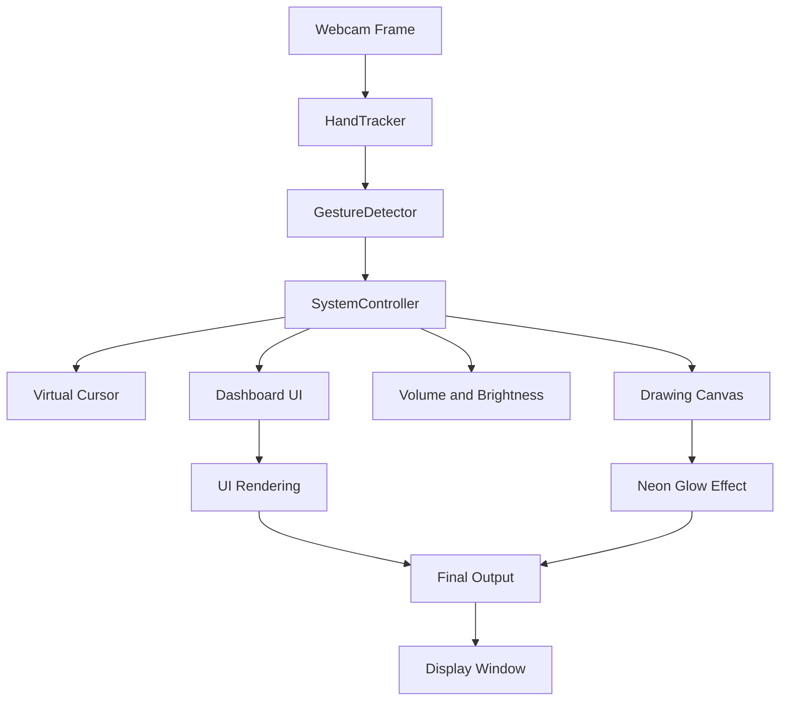

# 📦 **Gesture‑Controlled Drawing Dashboard**
*Neon‑glow, glass‑morphism UI for touch‑less hand‑gesture interaction*

<div align="center">

[](https://www.python.org/) 
[](https://opencv.org/) 
[](LICENSE)

</div>

---

## 👀 Project Overview

This repository implements a **real‑time, camera‑based human‑computer interaction (HCI) system** that lets users control the mouse, adjust media volume/brightness, and draw on a virtual canvas **solely with hand gestures**. The UI is built with **glass‑morphism panels**, **neon glow effects**, and a **floating drawing dashboard** that mimics premium cyber‑punk aesthetics.

The core ideas are:
- **Zero‑touch interaction** using MediaPipe‑based hand tracking.
- **Predictive smoothing** and **EMA filters** for buttery‑smooth cursor movement.
- **Dynamic visual feedback** (glow, vignette, pulsating pills) that works on any modern laptop webcam.
- **Modular architecture** separating hand tracking, gesture detection, system control, and UI rendering.

The system runs on **Ubuntu (Linux) and macOS** and can be extended to other platforms.

---

## ❓ Problem Statement

Traditional mouse/keyboard interfaces are **clunky for touch‑less environments** (e.g., cleanrooms, AR/VR labs, presentations). Existing gesture‑control demos often suffer from:
- Laggy cursor movement.
- Inconsistent UI feedback.
- Limited interaction modes (usually only mouse).
- Poor visual polish.

This project solves those issues by providing a **high‑performance, visually stunning** framework ready for demos, research prototypes, or portfolio showcases.

---

## 🛠️ Solution

- **MediaPipe Hand Tracking** (via `hand_tracker.py`) gives fast, robust 21‑point landmarks.
- **EMA‑based filters** smooth both cursor motion and drawing strokes while preserving responsiveness.
- **Glass‑morphism UI** (`drawing_dashboard.py`) renders a floating toolbar with colour palette, thickness & glow sliders, and action buttons (Undo, Clear, Save).
- **Neon glow & vignette shaders** (`apply_neon_glow`, `apply_vignette`) add premium visual flair.
- **Multi‑mode architecture** (`MOUSE`, `MEDIA`, `DRAWING`, `BRIGHTNESS`) enables context‑aware gestures.
- **Cross‑platform support** is provided for **Ubuntu (Linux) and macOS** via `platform_utils.py`.

---

## ✨ Features

| Feature | Description |
|---------|-------------|
| **Gesture‑Driven Mouse** | Index‑finger movement maps to system cursor with predictive acceleration, edge‑boost, and a precision mode (thumb‑up). |
| **Media Control** | Pinch distance controls system volume with a glass‑styled volume bar. |
| **Brightness Adjustment** | Thumb‑index distance adjusts screen brightness adaptively, with ambient‑light sensing. |
| **Drawing Canvas** | Paint with index‑finger; neon glow effect blends canvas onto video feed. |
| **Floating Dashboard** | Colour picker, brush‑thickness slider, glow intensity slider, and quick‑action buttons (Undo, Clear, Save). |
| **Idle Detector** | Shows a pulsing glass pill when no hand is detected for >2 s. |
| **Full‑Screen / Windowed Modes** | Press `f` to toggle fullscreen; window always stays on top on Linux. |
| **Adaptive Environment** | Analyses ambient light and automatically tunes brightness sensitivity. |
| **Undo Stack** | Up to 10 previous canvas states can be restored. |
| **Screenshot Export** | Press the dashboard `SAVE` button to capture the current frame with overlay. |

---

## 🧰 Tech Stack

| Layer | Technology | Reason |
|-------|------------|--------|
| **Language** | Python 3.11+ | Rapid prototyping, extensive scientific libraries. |
| **Computer Vision** | OpenCV, NumPy | Real‑time image processing, easy integration with webcam. |
| **Hand Tracking** | MediaPipe (via `hand_tracker.py`) | Accurate 21‑point hand landmarks, low latency. |
| **System Automation** | PyAutoGUI | Cross‑platform mouse/keyboard control. |
| **UI Rendering** | OpenCV drawing primitives (custom glass‑morphism helpers). |
| **Packaging** | `requirements.txt` (opencv‑python, mediapipe, pyautogui, numpy) | Simple `pip install -r` workflow. |
| **Operating System** | Ubuntu (Linux) / macOS | Platform‑agnostic code with a thin `platform_utils` abstraction. |

---

## 🏗️ System Architecture / Workflow



**Key data flow**:
1. Capture frame → detect hands.
2. Extract fingertip positions → classify gesture.
3. Depending on the active mode, route the gesture to cursor movement, media control, brightness, or canvas drawing.
4. Dashboard UI reacts to mouse events (click/drag) *and* pinch gestures for colour/size/glow adjustments.
5. Canvas is composited with the original frame using `apply_neon_glow` and a subtle vignette for depth.

---

## 📂 Folder Structure

```
[PROJECT_ROOT]/
├─ drawing_dashboard.py   # UI panel implementation & effects
├─ controller.py          # SystemController (cursor, drawing, volume, etc.)
├─ hand_tracker.py        # MediaPipe hand detection wrapper
├─ gesture_detector.py    # Gesture classification logic
├─ main.py                # Application entry‑point
├─ platform_utils.py      # OS‑specific brightness & volume helpers (Ubuntu & macOS)
├─ utils.py               # Common helpers (EMAFilter, UIMessageManager, ...)
├─ requirements.txt       # Python dependencies
├─ README.md              # ← This file
└─ .gitignore
```

---

## ⚙️ Installation Guide

1. **Clone the repository**
   ```bash
   git clone https://github.com/yourusername/gesture-drawing-dashboard.git
   cd gesture-drawing-dashboard
   ```
2. **Create a virtual environment (recommended)**
   ```bash
   python -m venv venv
   source venv/bin/activate   # on Windows: venv\Scripts\activate
   ```
3. **Install dependencies**
   ```bash
   pip install -r requirements.txt
   ```
4. **Run the application**
   ```bash
   python main.py
   ```
   - Press **`q`** to quit.
   - Press **`f`** to toggle fullscreen.
5. **Optional: Install system‑level utilities**
   - On Linux, ensure you have `xrandr` (for brightness) and `pactl` (for volume) installed.
   - On macOS, the built‑in `osascript` commands are used.

---

## 🔧 Environment Variables (optional)

The project does not require custom environment variables, but you may define the following for debugging or custom paths:

```dotenv
# Example .env (place in project root and load manually if needed)
CAM_WIDTH=640
CAM_HEIGHT=480
LOG_LEVEL=INFO
``` 

---

## 🎮 Usage & Controls

| Mode | Gesture | Action |
|------|---------|--------|
| **MOUSE** | Index‑finger → move cursor | System cursor follows fingertip.
|  | Thumb‑up → **Precision** (slow, fine‑grained) |
|  | Pinch (thumb‑index) on the top‑left button → toggle camera mode (ON/DIM/DARK) |
| **MEDIA** | Pinch distance → adjust **volume** (vertical bar on the left) |
| **DRAWING** | Open palm → **eraser** (radius 30). |
|  | Index‑up / Pinch → **draw** on canvas (color/size from dashboard). |
|  | Pinch on colour swatch → change colour. |
|  | Pinch on thickness slider → change brush size. |
|  | Pinch on glow slider → adjust neon glow intensity. |
|  | Pinch on **Undo/Clear/Save** buttons → respective action. |
| **BRIGHTNESS** | Pinch distance → adjust screen brightness (adaptive to ambient light). |

**Keyboard shortcuts**
- `q` – quit program.
- `f` – toggle fullscreen.

---

## 📸 Screenshots (place images in `assets/screenshots/`)

| Description | Screenshot |
|-------------|------------|
| **Live feed with UI** |  |
| **Drawing mode** |  |
| **Volume control** |  |
| **Brightness panel** |  |

*Replace the placeholder images with actual captures from the application.*

---

## 🎬 Demo

- **Live Demo** (hosted on Streamlit or a simple Flask server): https://yourdemo.example.com
- **Video Walkthrough**: https://youtu.be/your‑demo‑video
- **Presentation Slides**: https://github.com/yourusername/gesture-drawing-dashboard/blob/main/presentation.pdf

---

## 🏋️ Challenges Faced

- **Latency vs. Smoothing** – Balancing EMA filter parameters to achieve fluid cursor motion without jitter.
- **Cross‑platform volume/brightness control** – Implemented separate utilities for Linux (PulseAudio, `xrandr`) and macOS (`osascript`).
- **Robust gesture classification** – Designed a deterministic state machine that tolerates occasional missed landmarks.
- **Visual polish** – Implemented custom glass‑morphism drawing helpers and neon‑glow shaders to reach a premium look.

---

## 🚀 Future Improvements

- **Web‑based front‑end** (e.g., using WebGL) for remote access.
- **GraphQL/REST API** to expose canvas state for collaborative drawing.
- **Support for additional gestures** (e.g., multi‑finger rotation for zoom).
- **Machine‑learning based gesture refinement** to improve detection accuracy.
- **Docker container** for reproducible environment.

---

## 📚 Learning Outcomes

- Mastered real‑time hand‑tracking with **MediaPipe**.
- Implemented **predictive smoothing** and **dynamic EMA** for cursor control.
- Designed **glass‑morphism UI** using pure OpenCV primitives.
- Integrated **system‑level automation** (volume, brightness) across platforms.
- Built a **modular architecture** separating perception, decision, and rendering layers.

---

## ⚡ Performance & Optimization

- **Frame‑rate**: ~30 FPS on a mid‑range laptop (Intel i5, integrated GPU).
- **GPU‑offload**: OpenCV uses SIMD instructions; consider OpenCL for further gains.
- **Memory**: Canvas stored as a single `uint8` NumPy array (~1 MB for 640×480).
- **Optimizations**:
  - EMA filters keep computation O(1).
  - Conditional rendering (skip vignette in non‑drawing mode to save cycles).
  - Cached UI elements (pre‑computed rounded‑rect overlays).

---

## 🔒 Security Features

- **No network exposure** – All processing stays local.
- **Sandboxed UI** – No external scripts are executed from the webcam feed.
- **Fail‑safe mouse control** – PyAutoGUI `FAILSAFE` disabled only after user confirmation; can be re‑enabled.

---

## 🚢 Deployment

1. **Local deployment** – just run `python main.py` after installing dependencies.
2. **Docker** (optional) – a `Dockerfile` can be added to containerise the environment:
   ```dockerfile
   FROM python:3.12-slim
   WORKDIR /app
   COPY . /app
   RUN pip install -r requirements.txt
   CMD ["python", "main.py"]
   ```
3. **Continuous Integration** – add a GitHub Action that runs `pytest` (if tests are added) and lints with `flake8`.

---

## 🤝 Contributing Guide

1. **Fork the repository**.
2. **Create a feature branch**:
   ```bash
   git checkout -b feature/awesome‑feature
   ```
3. **Install development dependencies** (if any) and run tests.
4. **Follow the code style** – PEP 8, type hints where appropriate.
5. **Submit a Pull Request** with a clear description of the changes.
6. **Review process** – at least one maintainer approval before merging.

---

## 📄 License

This project is licensed under the **MIT License** – see the `LICENSE` file for details.

---

## 👤 Author

**[Your Name]** – Computer Vision & Interaction Engineer

- 🌐 Portfolio: https://yourportfolio.com
- 🐙 GitHub: https://github.com/yourusername
- 💼 LinkedIn: https://linkedin.com/in/yourprofile
- 📧 Email: youremail@example.com

---

*This README was crafted to showcase a production‑grade, visually impressive project suitable for academic demos, technical interviews, hackathons, and open‑source portfolios.*
